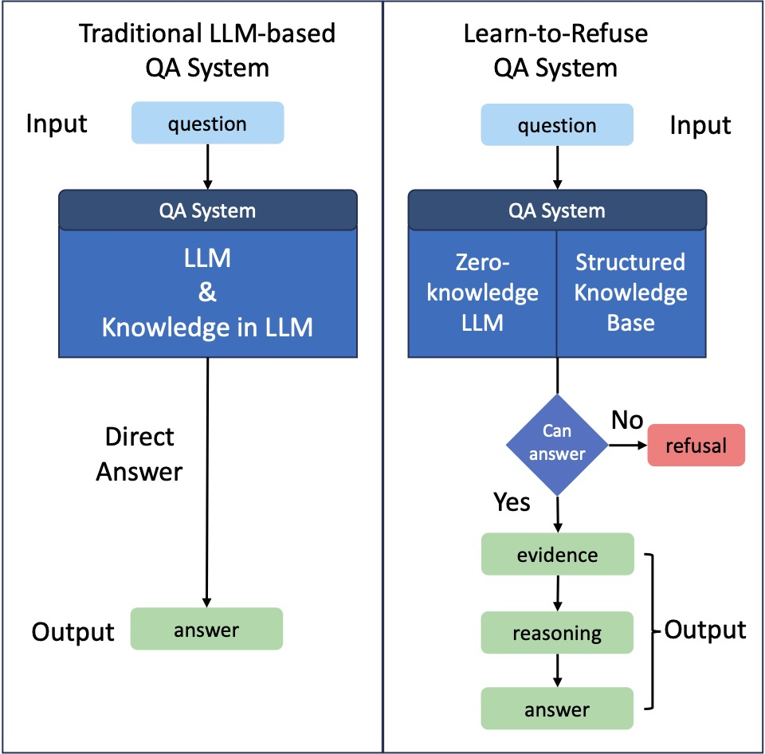

# Learn-to-Refuse

Code and data repo of the paper "[Learn to Refuse: Making Large Language Models More Controllable and Reliable through Knowledge Scope Limitation and Refusal Mechanism](https://arxiv.org/abs/2311.01041)"

## Introduction



Large language models (LLMs) have demonstrated impressive language understanding and generation capabilities, enabling them to answer a wide range of questions across various domains. However, these models are not flawless and often produce responses that contain errors or misinformation. These inaccuracies, commonly referred to as hallucinations, render LLMs unreliable and even unusable in many scenarios. In this paper, our focus is on mitigating the issue of hallucination in LLMs, particularly in the context of question-answering. Instead of attempting to answer all questions, we explore a refusal mechanism that instructs LLMs to refuse to answer challenging questions in order to avoid errors. We then propose a simple yet effective solution called Learn to Refuse (L2R), which incorporates the refusal mechanism to enable LLMs to recognize and refuse to answer questions that they find difficult to address. To achieve this, we utilize a structured knowledge base to represent all the LLM's understanding of the world, enabling it to provide traceable gold knowledge. This knowledge base is separate from the LLM and initially empty, and it is progressively expanded with validated knowledge. When an LLM encounters questions outside its domain, the system recognizes its knowledge scope and determines whether it can answer the question independently. Additionally, we introduce a method for automatically and efficiently expanding the knowledge base of LLMs. Through qualitative and quantitative analysis, we demonstrate that our approach enhances the controllability and reliability of LLMs.

## Quick Start

### Project Structure

```shell
.
├── cache
├── chain.py                   # L2R implementation
├── comparsion_exp             # comparsion / ablation
├── data
├── datasets_exp               # L2R in other datasets
├── demo.py                    # demo & test
├── enrich_knowledge.py        # enrich knowledge for L2R
├── env.py                     # api keys
├── evaluate.py                # evaluation
├── figures
├── knowledge
├── llama_version              # L2R based on Llama
├── main.py                    # run L2R
├── output
├── prompts                    # all prompts in the framework
├── requirements.txt           # dependencies
└── utils.py                   # utility functions
```

### Dependencies

* Python 3.10.9
* `pip install -r requirements.txt`

### Run

```shell
# Run knowledge enrichment
python enrich_knowledge.py
# Run L2R
python main.py
# Evaluate L2R
python evaluate.py

```

* Method implementation at `chain.py`.
* Other baselines and test: `wikipedia_l2r.py`, `wikipedia_rag.py`, `baseline.py`, `gold_l2r.py`, `gold_rag.py`.
* Experiments of other dataset at `/datasets_exp`.
* Experiments of llama2 at `/llama_version`.
* Results and temporary data are compressed.

## Cite us

If you find this repo useful, please cite the following paper:

```
@misc{cao2023learn,
      title={Learn to Refuse: Making Large Language Models More Controllable and Reliable through Knowledge Scope Limitation and Refusal Mechanism}, 
      author={Lang Cao},
      year={2023},
      eprint={2311.01041},
      archivePrefix={arXiv},
      primaryClass={cs.CL}
}
```